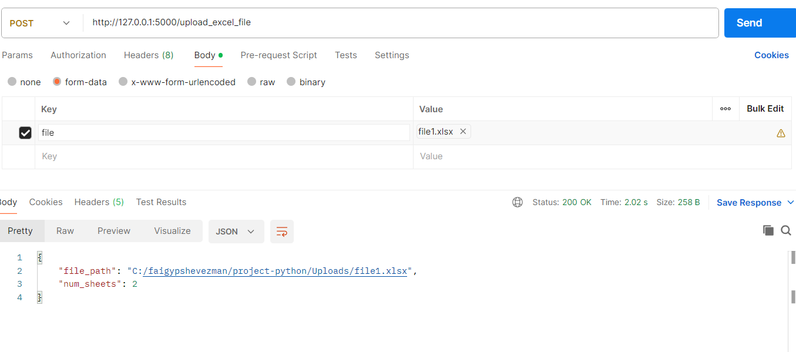
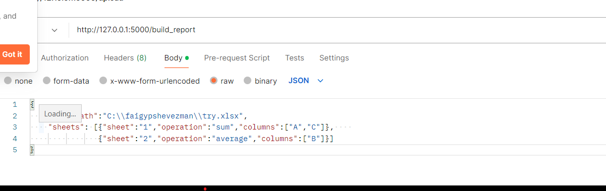
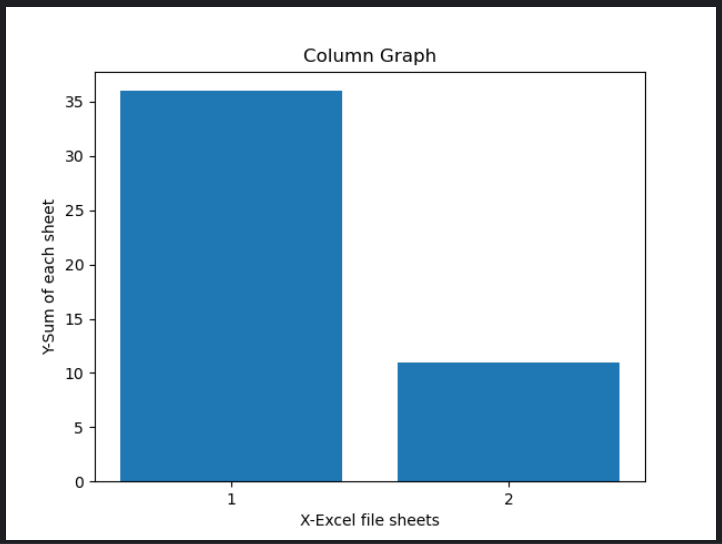
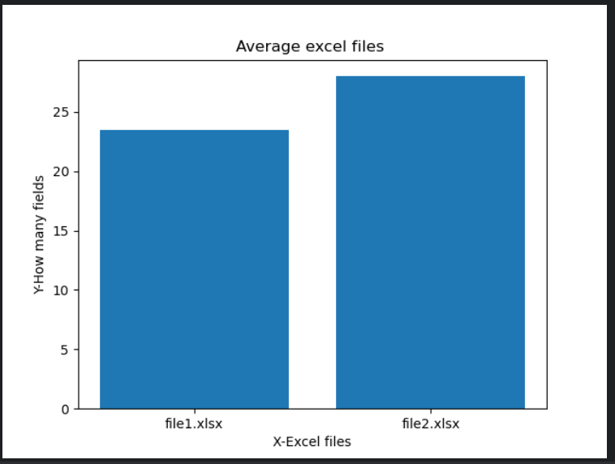

# python project
This Flask application has a system that accept Excel files with numerical data and processes the data for different results.

Usage
Upload an Excel file via the /upload_excel_file endpoint to analyze the data.
Use the /build_report endpoint to process the data and generate a PDF report.
Access the PDF report via the /create_pdf_report endpoint.

## Endpoints
#### /upload_excel_file:  
Upload an Excel file for analysis,The file will keep in the server system.
Activating this function through the postman:

#### /build_report:  
Process the uploaded file data and generate a JSON report.
Activating this function through the postman:

There is an option to activate the function through a call to the function with sending an object of the data:  
build_report(data)  
#### /create_pdf_report:
Create a PDF report on the request made to the files including(file name,sheet name,amount per sheet and average of each file)

## Functions
#### create_pdf_report(report):  
Generate a PDF report based on the processed data.  

#### count_sheets_in_excel_file(file_path):  
Counts how many sheets there are in a given an Excel file

#### calculate_sum_of_fields(path_file):  
Count how many full fields there are in all the sheets in an Excel given file

#### presentation_column_graph(path_file):  
retun a presentation column graph in which the sum of each sheet for example:  
  

#### average_excel_files(file_path_list):  
Calculating an average between Excel files(the average is between the pages) for example:  
  

#### amount_per_sheet(file_path,sheet):
Count how many full fields there are in specific sheet in an Excel given file

